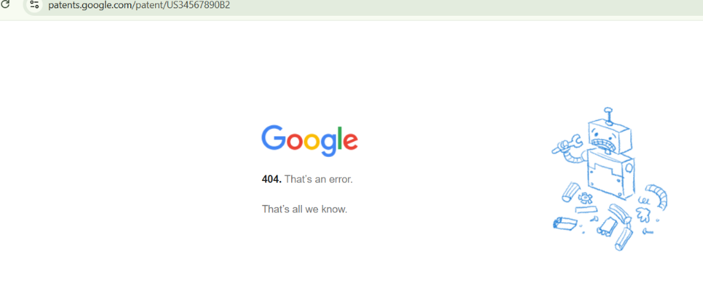
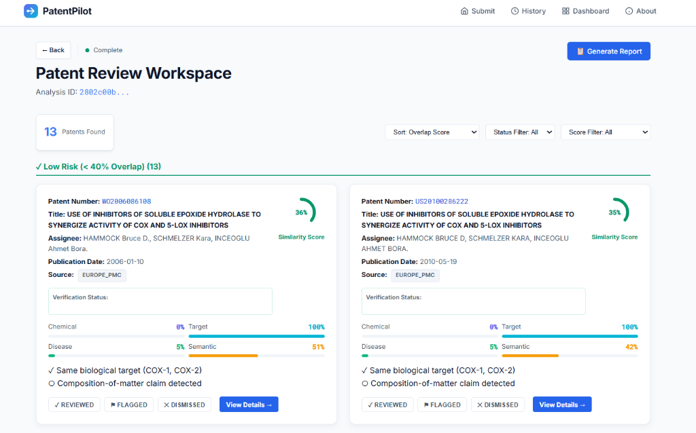
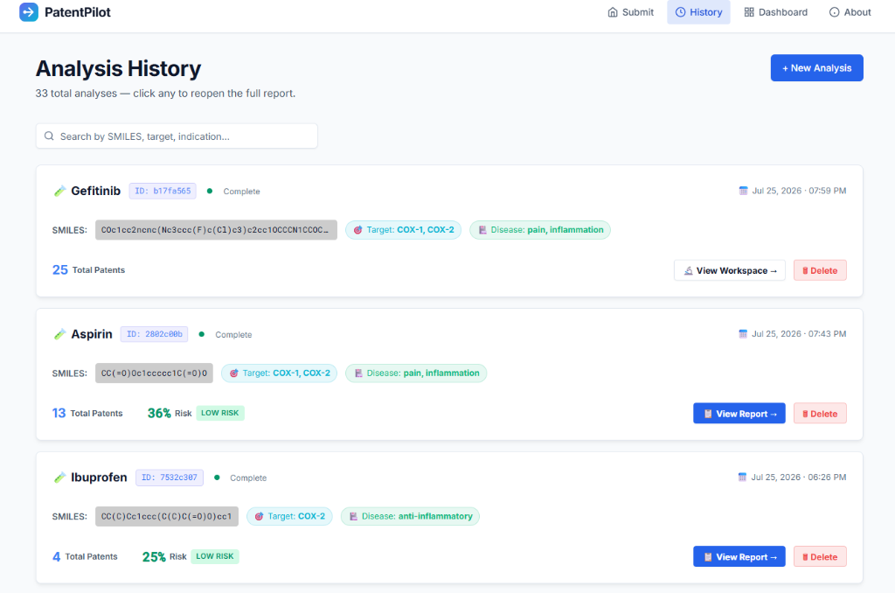
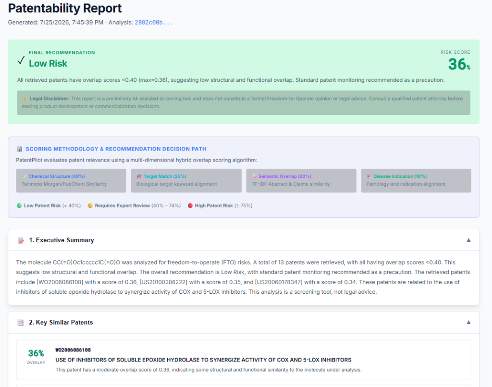
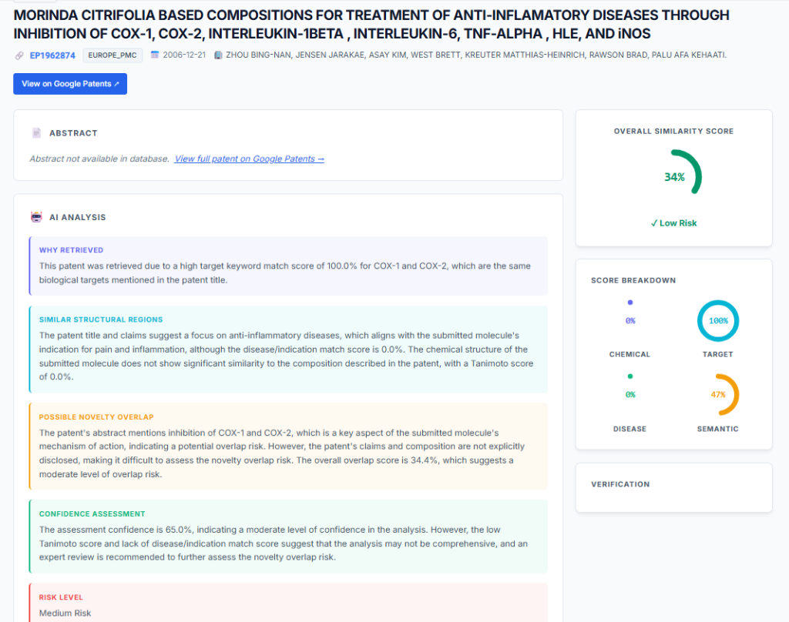
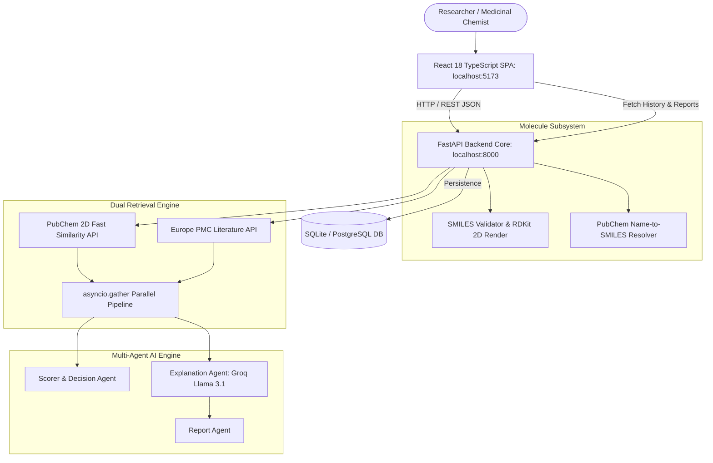
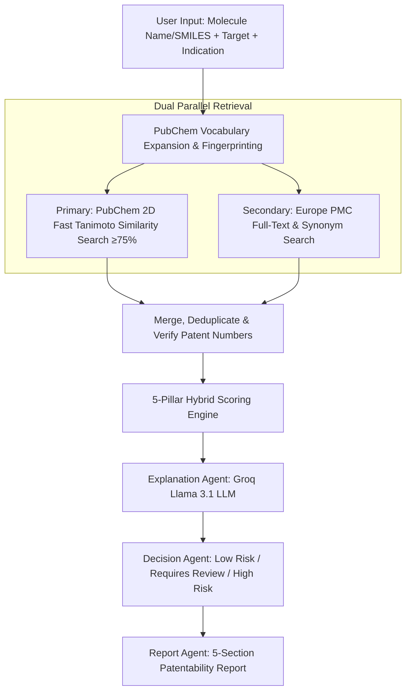

# 🧪 PatentPilot 🧬🔬

> **Autonomous AI-Assisted Freedom-to-Operate (FTO) & Patentability Screening Platform for Drug Discovery**

[](https://fastapi.tiangolo.com/)
[](https://vitejs.dev/)
[](https://groq.com/)
[](https://pubchem.ncbi.nlm.nih.gov/)
[](LICENSE)

---

## 📌 Executive Overview

**PatentPilot** is a full-stack, autonomous multi-agent platform designed to assist pharmaceutical researchers, medicinal chemists, and IP analysts in conducting rapid, preliminary **Freedom-to-Operate (FTO) and Patentability Screening**.

By simply typing a drug name (e.g., *Imatinib*, *Aspirin*, *Sildenafil*) or pasting a SMILES chemical structure, PatentPilot automatically resolves chemical identity via PubChem, searches over 110M+ compounds and millions of patents across public databases, scores structural and functional overlap using a deterministic 5-pillar hybrid model, and generates grounded, audit-ready patentability reports.

> ⚠️ **Legal Disclaimer**: PatentPilot is a decision-support screening aid and does not replace formal Freedom-to-Operate opinions or legal advice from registered patent attorneys.

---

## 📸 Application Screenshots

### Landing Page — Molecule Submission & PubChem Auto-SMILES


---

### Patent Review Workspace — Real-Time Overlap Scoring & Filters


---

### Analysis History Dashboard — Structured Record History & Action Buttons


---

### Structured Patentability Report — FTO Risk Recommendation & Scoring Rationale


---

### Patent Detail View — AI-Grounded Overlap Analysis & External Links


---

## 🏗️ System Architecture

PatentPilot's architecture decouples the React SPA presentation layer, the async FastAPI backend gateway, the dual retrieval pipeline, and the multi-agent AI engine.



---

## 🔄 Dual Pipeline & Agentic AI Workflow

PatentPilot combines **2D structural chemical search** with **semantic literature text search** in a concurrent execution pipeline.



---

## 🤖 Modular Multi-Agent Architecture

| Agent Name | Module Path | Primary Responsibility | Input Contract | Output Contract |
|---|---|---|---|---|
| **Retrieval Agent** | `backend/retrieval/agent.py` | Multi-source search orchestrator | SMILES, Target, Indication | Verified Patent List |
| **Explanation Agent** | `backend/ai/explanation_agent.py` | Grounded AI reasoning engine | Patent fields + sub-scores | Grounded Explanation JSON |
| **Scorer & Decision Agent** | `backend/ranking/scorer.py` | 5-pillar hybrid scoring & risk classification | Raw patents + query terms | Overlap score & Risk Label |
| **Report Agent** | `backend/ai/report_agent.py` | Patentability report synthesis | Ranked patents + explanations | 5-Section FTO Report JSON |

---

## ⚖️ Documented 5-Pillar Scoring Methodology

PatentPilot calculates a deterministic **Overall Overlap Score** (0.0 to 1.0) using a weighted 5-component hybrid formula:

$$\text{Overlap Score} = 0.40(S_{\text{chem}}) + 0.25(S_{\text{target}}) + 0.20(S_{\text{semantic}}) + 0.10(S_{\text{disease}}) + 0.05(S_{\text{recency}})$$

### Weight Breakdown:
- 🧪 **Chemical Structure Similarity ($S_{\text{chem}}$, 40%)**: Tanimoto coefficient on 2D Morgan/PubChem fingerprints.
- 🎯 **Biological Target Match ($S_{\text{target}}$, 25%)**: Alignment of biological protein, gene, or receptor targets.
- 📝 **Semantic Overlap ($S_{\text{semantic}}$, 20%)**: TF-IDF cosine similarity across patent title, abstract, and independent claims.
- 🏥 **Disease Indication Match ($S_{\text{disease}}$, 10%)**: Therapeutic area and pathology term matching.
- ⏳ **Patent Recency ($S_{\text{recency}}$, 5%)**: Publication age normalization (newer patents carry higher weight).

### Decision Threshold Rules:
- 🟢 **`Low Patent Risk`** (Overall Overlap Score $< 40\%$)
- 🟡 **`Requires Expert Review`** (Overall Overlap Score $40\% - 74\%$)
- 🔴 **`High Patent Risk`** (Overall Overlap Score $\ge 75\%$)

---

## 📄 5-Section Patentability Report Structure

Once patent review is triggered, PatentPilot generates an audit-ready **Patentability Report** adhering strictly to client requirements:

1. 📝 **1. Executive Summary**: Multi-paragraph summary detailing molecule context, search findings, and FTO recommendation.
2. 📑 **2. Key Similar Patents**: Structured cards highlighting top overlapping patents, Tanimoto scores, and specific overlap concerns.
3. ⚠ **3. Potential Novelty Concerns**: Enumerated list of specific novelty risks and structural/functional overlap warnings.
4. 🔎 **4. Patents Requiring Manual Review**: Dedicated section listing patents needing attorney inspection with patent number, title, score, and explicit review reason.
5. 🎯 **5. Overall Recommendation**: Clearly displays one of `Low Patent Risk`, `Requires Expert Review`, or `High Patent Risk` alongside a documented rationale & decision path.

---

## 🛠️ Technologies Used

| Layer | Technology | Purpose & Justification |
|---|---|---|
| **Frontend UI** | React 18 + TypeScript + Vite | Ultra-fast SPA, type-safe development, modern CSS design tokens |
| **Backend Framework** | FastAPI (Python 3.11) | Async native performance, automatic Pydantic validation, OpenAPI docs |
| **AI / LLM Engine** | Groq API (`llama-3.1-8b-instant`) | Low-latency inference, OpenAI-compatible JSON mode |
| **Cheminformatics** | RDKit & PubChem PUG REST API | SMILES validation, 2D structure SVG generation, Tanimoto similarity |
| **Patent Sources** | PubChem + Europe PMC | Free, comprehensive public APIs providing structural & full-text patent data |
| **Database** | SQLite (Dev) / PostgreSQL (Prod) | Relational storage for analyses, patent results, and reports |
| **HTTP Client** | `httpx` (async) | Concurrent asynchronous API requests with retry backoff |

---

## 💡 Assumptions Made

1. **Public API Adequacy**: Public APIs (PubChem, Europe PMC, Google Patents) provide sufficient coverage for an initial FTO screening aid; full legal clearance requires proprietary databases (e.g. Derwent Innovation).
2. **Grounded LLM Guidance**: Injecting raw patent text and computed scores into Groq prompts prevents LLM hallucination while generating accurate explanations.
3. **Automatic Fallbacks**: When external APIs encounter network timeouts, PatentPilot falls back to rule-based algorithms to ensure 100% uptime.

---

## ⚖️ Trade-offs

| Domain | Trade-off Made | Rationale |
|---|---|---|
| **Speed vs. Coverage** | Top 25 patent ranking with parallel fetch | Keeps search time under 30 seconds while retaining high-risk hits |
| **Cost vs. Model Size** | Groq Llama 3.1 8B vs. GPT-4o | Groq provides sub-second LLM inference at zero cost for real-time responsiveness |
| **Search Scope** | Title + Abstract NLP vs. Full Claim Parsing | Public APIs limit full claim access; full claims are flagged for manual attorney review |

---

## 🚀 Future Improvements

1. **Substructure & Markush Searching**: Enable RDKit substructure queries to match generic Markush patent claims.
2. **ChemBERTa Embeddings**: Replace TF-IDF with deep molecular transformer embeddings for semantic chemical similarity.
3. **Multi-Jurisdiction Filtering**: Filter patent hits by jurisdiction (USPTO, EPO, WIPO, NIPA).
4. **PDF Report Export**: One-click download of PDF patentability reports.

---

## 💻 Local Setup & Installation Instructions

### Prerequisites
- **Python**: 3.11 or higher
- **Node.js**: 18.0 or higher
- **Git**

---

### Step 1: Clone Repository
```bash
git clone https://github.com/SaiPavan-28/PatentPilot.git
cd patentpilot
```

---

### Step 2: Backend Setup
```bash
# Navigate to backend (or project root)
python -m venv venv
# On Windows:
venv\Scripts\activate
# On Linux/macOS:
# source venv/bin/activate

# Install Python dependencies
pip install -r backend/requirements.txt
```

#### Environment Variables (`backend/.env`):
Create a `.env` file inside `backend/` or project root:
```env
GROQ_API_KEY=your_groq_api_key_here
GROQ_MODEL=llama-3.1-8b-instant
DATABASE_URL=sqlite:///./patentpilot.db
```

#### Run Backend Server:
```bash
python -m uvicorn backend.main:app --host 0.0.0.0 --port 8000 --reload
```
- 🌐 Backend API: `http://localhost:8000`
- 📚 Interactive API Docs (Swagger): `http://localhost:8000/api/docs`

---

### Step 3: Frontend Setup
Open a new terminal window:

```bash
cd frontend
npm install
npm run dev
```
- 🖥️ Frontend Web App: `http://localhost:5173`

---

## 🧪 Testing with Example Compounds

Try submitting any of these example inputs on the Home page:
- **By Name**: Type `Imatinib`, `Aspirin`, `Sildenafil`, or `Atorvastatin` -> SMILES will auto-fill automatically!
- **By SMILES**: `CC(=O)Oc1ccccc1C(=O)O` (Aspirin), Target: `COX-2`, Indication: `Inflammation`

---

*Built for Centella AI Therapeutics — Freedom-to-Operate & Patentability Intelligence Engine.*
